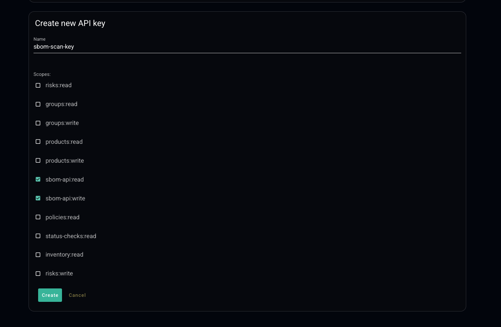

<p align="center">
  <a href="https://app.arnica.io">
    
  </a>
</p>

## Arnica SBOM Scan – GitHub Action

Reusable GitHub Action that generates a Software Bill of Materials (SBOM) using cdxgen, uploads it to Arnica, and waits for the scan to complete, returning the scan identifier and final status.

### Quickstart

Add a workflow that uses this action. Replace `owner/repo` and the token secret with your values.

```yaml
name: Upload SBOM to Arnica
on:
  workflow_dispatch:

jobs:
  upload:
    runs-on: ubuntu-latest
    permissions:
      contents: read
    steps:
      - name: Checkout repo (if SBOM is in this repo)
        uses: actions/checkout@08c6903cd8c0fde910a37f88322edcfb5dd907a8 # v5.0.0
        with:
          persist-credentials: false

      - name: Generate SBOM and scan with Arnica
        id: arnica
        uses: arnica-ext/scan-sbom@v1
        env:
          ARNICA_API_TOKEN: ${{ secrets.ARNICA_API_TOKEN }}
        with:
          repository-url: https://github.com/owner/repo
          branch: main
          scan-path: .
          api-base-url: https://api.arnica.io

      - name: Print outputs
        run: |
          echo "scan-id=${{ steps.arnica.outputs['scan-id'] }}"
          echo "status=${{ steps.arnica.outputs.status }}"
```

### Inputs

| Name                   | Required | Default                 | Description                                                                |
| ---------------------- | :------: | ----------------------- | -------------------------------------------------------------------------- |
| `repository-url`       |   Yes    |                         | Repository URL associated with the SBOM                                    |
| `branch`               |    No    | `main`                  | Branch to associate with the scan                                          |
| `scan-path`            |   Yes    |                         | Directory path to scan and generate SBOM for (e.g., `.` or `services/api`) |
| `api-base-url`         |   Yes    | `https://api.arnica.io` | Arnica API base URL                                                        |
| `api-token`            |    No    |                         | Arnica API token; prefer secret env `ARNICA_API_TOKEN`                     |
| `curl-flags`           |    No    |                         | Extra flags passed to `curl`                                               |
| `scan-timeout-seconds` |    No    | `900`                   | Timeout (seconds) to wait for scan completion                              |
| `on-findings`          |    No    | `fail`                  | Behavior when findings are detected: fail, alert, or pass                  |
| `cdxgen-version`       |    No    | `11.3.2`                | Version of @cyclonedx/cdxgen to install                                    |

### Outputs

- **scan-id**: Arnica scan identifier.
- **status**: Final status, one of `Success`, `Failure`, `Error`, `Skipped`, or `Timeout`.

### Environment variables

- **ARNICA_API_TOKEN**: Alternative to the `api-token` input. Recommended to pass via `${{ secrets.ARNICA_API_TOKEN }}`.

### Permissions

This action does not require repository write permissions. For least privilege, set:

```yaml
permissions:
  contents: read
```

### Examples

Scan a subdirectory and alert (do not fail) on policy violations:

```yaml
- name: Generate SBOM and scan with Arnica
  id: arnica
  uses: arnica-ext/scan-sbom@v1
  env:
    ARNICA_API_TOKEN: ${{ secrets.ARNICA_API_TOKEN }}
  with:
    repository-url: https://github.com/owner/repo
    branch: ${{ github.ref_name }}
    scan-path: services/payments
    on-findings: alert
```

### Prerequisites

- Sign in to Arnica with a privileged `admin` account. Sign in at `https://app.arnica.io`.

### API key and permissions

Create an Arnica API key with only the SBOM scopes:

1. Navigate to Admin → API.
2. Create a new API key.
3. Select scopes: `sbom-api:read` and `sbom-api:write` only.
4. Store the token as a repository secret named `ARNICA_API_TOKEN`.

UI example:



### Security and best practices

- Always pin this action to a specific commit SHA; avoid mutable tags (prefer `@<commit-sha>` over `@v1`).
- Pass the API token through secrets (`ARNICA_API_TOKEN`); avoid hardcoding tokens.
- Use minimal workflow `permissions`.
- Review workflow logs for any sensitive output before sharing.

### Contributing

See `CONTRIBUTING.md` for development, testing, and release guidance. Please open an Issue first for substantial changes.

### Code of Conduct

This project adheres to a Code of Conduct. By participating, you agree to uphold it. See `CODE_OF_CONDUCT.md`.

### License

MIT — see `LICENSE.md`.

### Support

Questions or issues? Open a GitHub Issue. You can also propose enhancements via a feature request Issue or PR.
